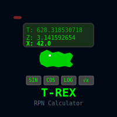

# T-REX 3.0

[](https://badge.fury.io/rb/t-rex)
[](https://www.ruby-lang.org/)
[](https://unlicense.org/)
[](https://github.com/isene/T-REX/stargazers)
[](https://isene.org)

 T-REX - Terminal Rpn calculator EXperiment
<br clear="left"/>

Created using the [rcurses](https://github.com/isene/rcurses) library - the smoothest way to build curses applications in Ruby.

This is a Reverse Polish Notation calculator similar to the traditional calculators from Hewlett Packard. See https://www.hpmuseum.org/rpn.htm for info on RPN.

**NEW in 3.0**: Major XRPN integration providing hybrid calculation modes, enhanced mathematical functions, program execution environment, program editor, base conversions, factorial safety, and comprehensive scrolling support.

## Installation

Install with: `gem install t-rex`

Or clone this repo and run: `gem build t-rex.gemspec && gem install t-rex-*.gem`

This software runs in a terminal emulator and requires Ruby to be installed. Tested on Linux.

The stack is shown to the top left: L is the "Last X" register showing the previous value in X. T, Z, Y and X registers comprise the operating stack. Toggle US and European number formats by pressing '. 

When entering a number into X, use 'h' to change the sign and 'e' to write an exponent (10^x). Entering "123e4" becomes "1230000". Use 'H' to enter a minus sign after an 'e' to get a negative exponent. Entering "123e-4" becomes "0.0123". 

Functions available are shown under the stack registers. The orange symbol corresponds to the key to be pressed. For functions above each label (grey functions), press the Control key (Ctrl) and the orange key (asin = Ctrl+i).

For Rectangular to Polar conversions:
```
R-P: X value in x, Y in y - yields "θ" in y and "r" in x.
P-R: "θ" in y and "r" in x - yeilds X in x and Y in y.
```

Use the "f" key to set the fixed number of decimal places.

Use the "s" key to set the limit for viewing numbers in the "scientific" notation (e.g. 5e+06 for 5000000).

Use "Ctrl+E" to toggle ENG (engineering notation) mode. In ENG mode, exponents are always multiples of 3 (e.g. 1230 becomes 1.2300e+003, 0.0045 becomes 4.5000e-003), making it easier to interpret values in engineering units (millis, micros, nanos, etc.).

Content of registers #0-#9 are shown below the functions.

Store/recall using capital "S"/"R". "M" clears the regs.

You can undo all the way to the beginning of the session.

The 'H' key toggles between the help text in the right pane or a continuous printout.  Save the full printout to ~/t-rex.txt with "Ctrl-P".

The stack, register contents, modes and help text settings are saved on Quit.

Additionally, you can access the "Ruby mode" via '@'. Here you can address the stack directly, e.g. 'x = y + (z / t); puts x'. Quit Ruby mode with ESC.
 
Alternative keys: Left/Right keys (in addition to "<") exchanges X and Y registers. Backspace clears the x register.

## XRPN Integration (NEW in 3.0)

T-REX now integrates with the [XRPN language](https://github.com/isene/xrpn) to provide enhanced mathematical capabilities and programmable calculator features.

### Installation of XRPN
```bash
gem install xrpn
```

### XRPN Features

**Mode Toggle**: Press `X` to switch between T-REX and XRPN calculation modes.

**In XRPN Mode:**
- **Ctrl+F**: Safe factorial function (max 170!)
- **Ctrl+B**: Number base conversions (hex, binary, octal, decimal)
- **P**: Program execution environment (ESC to exit)
- **E**: Program editor (ESC to exit)
- Enhanced precision and error handling for all mathematical operations
- Access to 250+ mathematical functions from the XRPN language

**Program Execution (P key):**
- `l <file>` - Load XRPN program from file
- `x <name>` - Execute program by name
- `r <cmd>` - Run single XRPN command
- `s` - Show current stack
- `p` - List loaded programs
- `status` - Show XRPN status

**Program Editor (E key):**
- `new <name>` - Create new program
- `add <line>` - Add line to current program
- `list` - List current program
- `del <n>` - Delete line n
- `save` - Save current program
- `run` - Run current program
- `clear` - Clear current program

**Scrolling Support**: Both P and E modes support full scrolling with Shift+UP/DOWN, PgUP/PgDOWN, HOME/END for navigating long program listings and output.

## Copy/Paste to/from X
You can paste numbers directly to the x register the normal way (middle mouse
button or Shift+Insert). You can copy/yank the number in the x register by
pressing "y" to paste in into other applications (needs "xclip" installed).

To paste the full set of 10 memory registers to the clipboard, use "Y".

## Ruby mode
Additionally, for a world of possibilities, you can access the "Ruby mode" via '@'.
Here you can address the stack directly, e.g. x = y + (z / t). Quit Ruby mode with ESC.

## Screencast

[](https://youtu.be/vhSFH1j-vEY)
